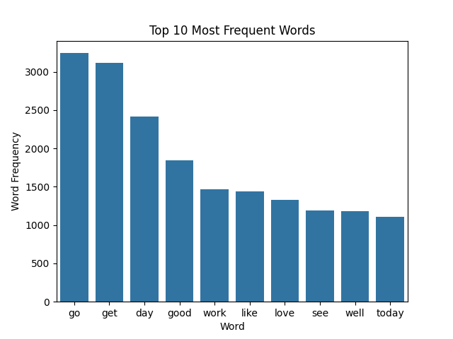
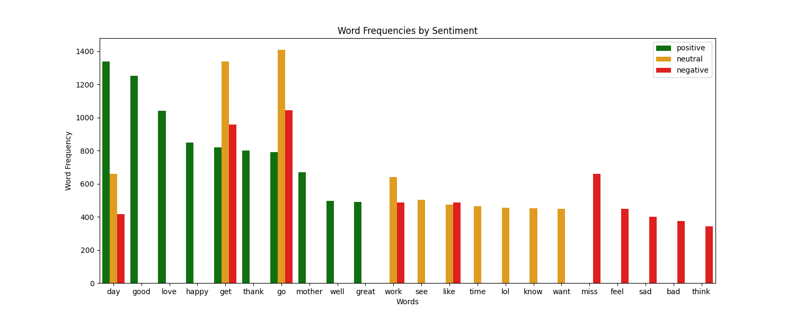
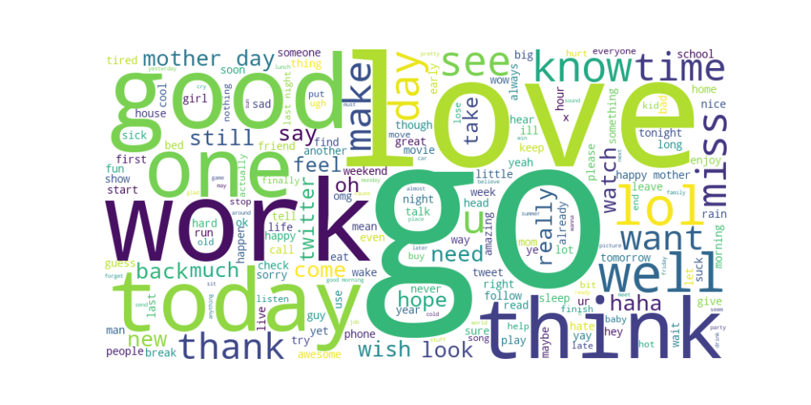
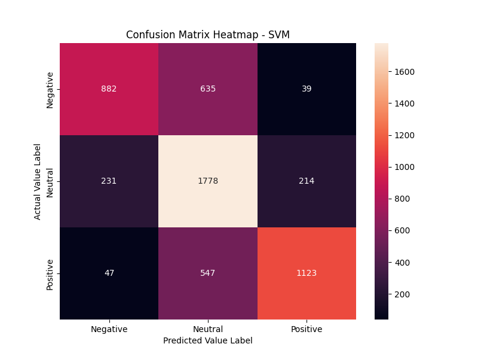
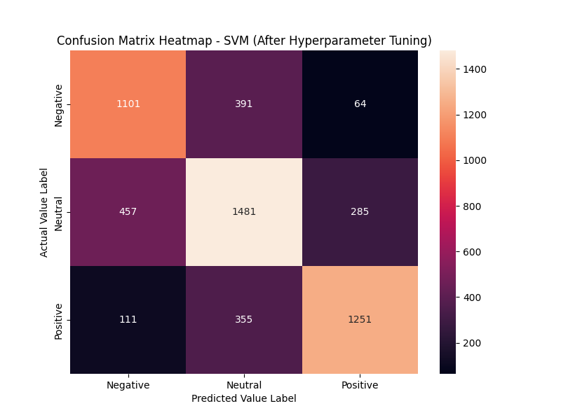

# Text Sentiment Analysis 
Text Sentiment Analysis is the means to identify the emotion of a person based on a text. It is a sub-field of Natural Language Processing (NLP). This project aims to analyze human sentiment on the basis of text with the help of Machine Learning Technique.

There are various processes involved in this project:
1. Data Collection
2. Data Preprocessing
3. Exploratory Data Analysis (EDA)
4. Train Test Split
5. Feature Engineering
6. Model Selection and Training
7. Model Evaluation
8. Hyperparameter Tuning 

### Data Collection
Data is about the tweets of people on twitter. The data is in csv format and consists of 4 columns (text_id, text, selected_text, sentiment) and 27500 rows. The data is labelled based on the tweets made by the people on twitter and labelled as Negative, Neutral and Positive. The data is available on the Kaggle. The link to the data: https://www.kaggle.com/datasets/yasserh/twitter-tweets-sentiment-dataset 

### Data Preprocessing
Firstly, I removed the unwanted columns like text_id and selected_text. The NaN values from the dataset are removed and all the data is converted into lower case. The data is from twitter and it consists of user mentions, links, hashtags, numbers and special characters. This has no effects on the user's sentiments. So, it is removed using regular expressions. The data free of NaN values,  user mentions, links, hashtags, numbers and special characters is tokenized and stored in a new column named as token. Tokenization breaks the text into smaller parts and helps the machine understand the human languages. In case the user data is converted into individual words. Lemmatization is performed in tokenized data. Lemmatization converts the words to their base form. It helps to improve the accuracy of text processing. After lemmatization, stopwords from English are removed. Stopwords removes the most common English words like the, a, is etc. This allows the machine to focus on the important words responsible for human sentiment.

### Exploratory Data Analysis (EDA)
Some major visualization from the data is performed like most frequent words, word frequencies with respect to sentiment, wordcloud. 

**Top Frequent Words**

**Top Frequent Words According to Sentiment**

**WordCloud**

### Train Test Split
The dataset is splitted for training (80%) and testing (20%) purposes and stratified sampling is used for balanced dataset. Stratified sampling technique is used to balance the class distribution. It distributes the classes evenly for training and testing. It reduces the biases of the model towards a certain class. 

### Feature Engineering
In feature engineering, vectorization is performed. Vectorization converts the text into numerical features which makes it suitable for machine learning models. In this project Frequency-Inverse Document Frequency (TF-IDF) vectorized technique is used.  Bag of Words (Countvectorizer) isn’t used in this project; it only counts the frequency of words in a document. However, TF-IDF is vectorized, counts the frequency and also considers the importance of words in a document. It also reduces the impacts of less important words.

Word embedding technique is not considered for this project. These techniques are better for deep learning models when there is a large dataset and when semantic meaning is crucial.

### Model Selection and Training
Multiple algorithms like Logistic Regression, Naive Bayes, Support Vector Machines (SVM), Random Forest and XGBoost are used for training purposes. 

### Model Evaluation
All the trained algorithms are evaluated using classification report, confusion matrix and AUC-ROC score. After evaluation of all the algorithms, SVM is chosen for deployment and hypermeter tuning because it provides slightly better metrics than others. Furthermore, SVM works well with textual data and there are fewer hyperparameters to tune.

**Confusion Matrix**

**Confusion Matrix after Optimization**

### Hyperparameter Tuning 
The SVM model is optimized using GridSearch. The parameters for optimal C, kernel and class weight are selected from gridsearch. 5-fold cross validation, f1 weighted is used for scoring metric. After the hyperparameter tuning the accuracy increased to 70% and also contributed to more balanced class-wise performance. Furthermore, 5-fold stratified cross-validation ensures robust performance estimation and reduces risk of overfitting
